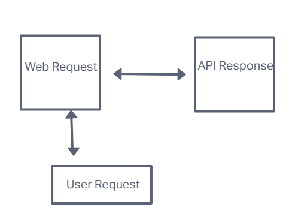

# city-explorer-api

**Author**: Kaitlin Davis

**Version**: 1.0.0

## Overview

City Explorer serves as a convenient location-based tool, harnessing the capabilities of the LocationIQ API. This user-friendly application empowers users to input search queries, often in the form of city or place names. It seamlessly communicates with LocationIQ via API calls to access and showcase valuable information such as the city's name, its precise latitude and longitude coordinates.

## Getting Started

In order to build this app on your machine and run it, you will need to make a Repo on Gitgub, clone the repository in Git, install dependencies using npm, install any project dependencies such as package.json, obtain a Location IQ API and then incorporate your access token in your code. Start your server and input a name of the city you wish to look for and hit search.

## Architecture

Technologies and Libraries Used:

Frontend (React):

The frontend is built using the React library, which enables the creation of a dynamic and interactive user interface. React allows for the efficient management of component rendering and state, enhancing user experience.
HTTP Requests (Axios):

Axios is the chosen library for making HTTP requests to the LocationIQ API. It simplifies the process of handling asynchronous requests and responses, ensuring smooth communication between the frontend and the API.
Styling and Responsiveness (Bootstrap):

Bootstrap, a popular CSS framework, is employed for styling the application and making it responsive across different devices and screen sizes. Specifically, the Bootstrap Alert component is used to display error messages in case of API call failures, enhancing the user interface.
API Integration (LocationIQ):

The application relies on the LocationIQ API to retrieve geographical information based on user input. This API serves as the core data source for the City Explorer, enabling the retrieval of city details, latitude, longitude, and other relevant location-based data.

## Change Log

12/7/2023 - Fully functional live server where you can input a city and its longitutde and latitude will pop up along with a correct map.

## Credit and Collaborations

ChatGPT

## Data Flow

## Time Estimates
Name of feature: Map

Estimate of time needed to complete: 1 hour

Start time: 11:30pm 

Finish time: 1:30am

Actual time needed to complete: 2 hours

## Lighthouse

.